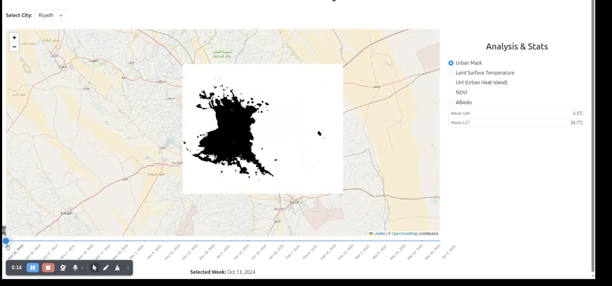

# Urban Heat Monitoring

This project includes a FastAPI backend and a React frontend, with separate folders for each. The application visualizes various heat maps and temporal data for urban areas, such as NDVI, UHI, LST, NDBI, Albedo, and other zonal statistics. The app provides users with a comprehensive view of urban heat trends, enabling the analysis of various environmental factors over time.



## Features

- **Urban Heat Island (UHI)**: Visualizes the temperature differences between urban areas and surrounding rural regions.
  
- **Land Surface Temperature (LST)**: Displays the surface temperature of different areas over time, helping to analyze temperature patterns in urban and rural zones.
  
- **Normalized Difference Vegetation Index (NDVI)**: Provides insights into vegetation health in both urban and rural areas. This index is useful for monitoring green cover and vegetation stress over time.

- **Normalized Difference Built-up Index (NDBI)**: Shows urbanization patterns by highlighting built-up areas. This index is often used to monitor urban expansion and built environment changes.

- **Albedo**: Helps analyze the surface reflectance characteristics of different surfaces (e.g., urban heat island zones, water bodies, forests) that influence local climate and temperature patterns.

- **Zonal Statistics**: Computes various statistics for specific zones, such as the average temperature (LST), vegetation index (NDVI), urbanization index (NDBI), etc. for further analysis of urban and rural trends.


## Prerequisites

Before running the app, ensure you have the following installed:

- Python 3.8 or higher
- Node.js and npm (Node Package Manager)
- Git

You can download and install them from:

- [Python](https://www.python.org/downloads/)
- [Node.js](https://nodejs.org/)

## Installation

### Backend (FastAPI)

1. Clone this repository to your local machine:

    ```bash
    git clone git@github.com:OmdenaAI/GuardinanSpace-urban-heatmonitoring.git
    cd GuardinanSpace-urban-heatmonitoring
    ```

2. Set up a virtual environment (recommended):

    ```bash
    python3 -m venv env
    source env/bin/activate  # On Windows, use `env\Scripts\activate`
    ```

3. Install the required Python dependencies:

    ```bash
    pip install -r requirements.txt
    ```

### Frontend (React)

1. Navigate to the `client` folder (or where your React app resides):

    ```bash
    cd client
    ```

2. Install the required Node.js dependencies:

    ```bash
    npm install
    ```

## Running the Backend (FastAPI)

1. Go back to the root directory of the project (where `server.py` is located):

    ```bash
    cd ..
    ```

2. Run the FastAPI server using Uvicorn:

    ```bash
    uvicorn server:app --reload
    ```

    This will start the backend server on `http://127.0.0.1:8000`. The `--reload` flag will automatically restart the server whenever you make changes to the code.

## Running the Frontend (React)

1. In a separate terminal window, go to the `client` folder (or where `index.jsx` is located):

    ```bash
    cd client
    ```

2. Start the React development server:

    ```bash
    npm start
    ```

    This will start the frontend server on `http://localhost:3000`. React will hot-reload changes as you develop.

## Accessing the Application

Once both servers are running:

- Access the FastAPI backend at `http://127.0.0.1:8000`.
- Access the React frontend at `http://localhost:3000`.

The frontend should be able to make API requests to the backend. Make sure you handle the backend API's URL in the React app accordingly (e.g., `http://127.0.0.1:8000/api/endpoint`).

## Environment Variables

If your app requires any environment variables (e.g., database credentials, secret keys), create a `.env` file in the root directory of the project.

For FastAPI, you can use `python-dotenv` to load environment variables in `server.py`. For React, you can define environment variables in a `.env` file inside the `client` folder (e.g., `REACT_APP_API_URL=http://127.0.0.1:8000`).

### Example `.env` file for FastAPI:
```plaintext
GOOGLE_CREDENTIALS_PATH=path_to_credentials.json
FOLDER_ID=your_folder_id
DATAPATH=data
```

### 📥 Download Data

To download the data, run the following command:  
> ⚠️ Make sure you have configured your **Google Drive API credentials** before proceeding.

```bash
python server/download.py
```


Once downloaded you will be able to visualize the map using slider. You can select different modes for visualization: uhi, ndvi, ndbi etc.

Here are some processed data which is accessible publicly for short term: [link](https://drive.google.com/drive/u/0/folders/1J7EJ4HSHA7HoRV-tB5Xwh19_1WVBE-Uk)


### ⚙️ Process Visualization Data

The data processing scripts are written in Python and located in the `gee/` directory.  
Before running any script, make sure your **Google Earth Engine (GEE)** account is properly configured and authenticated.

To process NDVI data, for example, run:

```bash
python gee/ndvi.py
```

**OR**
Alternatively, you can use the JavaScript version available in the gee/js/ folder.
Simply copy the ndvi.js script and run it directly in the Google Earth Engine Code Editor.